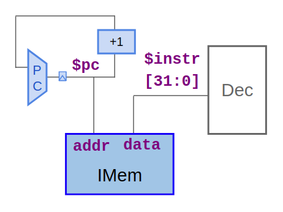
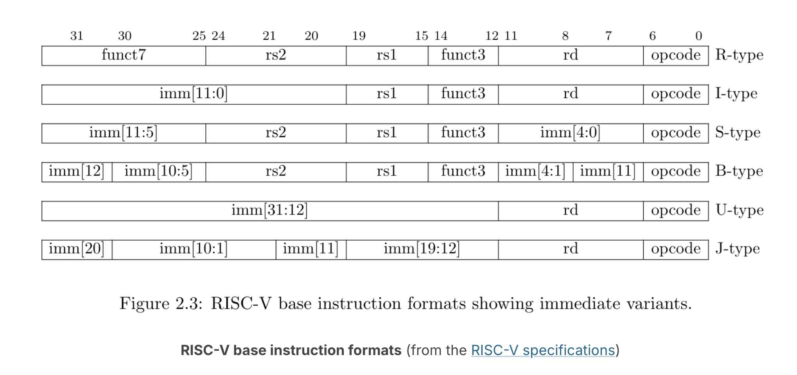
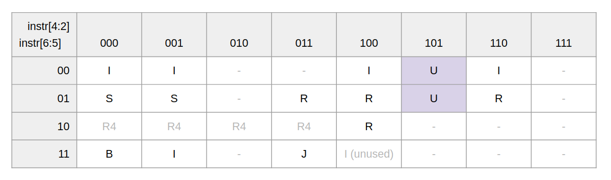
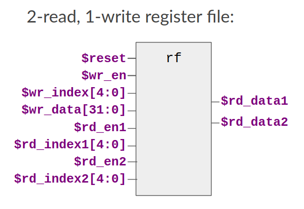

# RISC-V CPU Core  

This repository contains my implementation of a **32-bit Single-Cycle RISC-V (RV32I) CPU Core** designed in **TL-Verilog** and simulated on the **Makerchip IDE**.  

The project demonstrates how the fundamental components of a processor work together to execute instructions, following the RISC-V ISA specification.  

---

## Table of Contents  
- [Overview](#overview)  
- [Implementation Plan](#implementation-plan)  
- [CPU Datapath](#cpu-datapath)  
- [Modules](#modules)  
  - [Program Counter (PC) Logic](#program-counter-pc-logic)  
  - [Instruction Memory](#instruction-memory)  
  - [Decode Logic](#decode-logic)  
  - [Register File (Read & Write)](#register-file-read--write)  
  - [Arithmetic Logic Unit (ALU)](#arithmetic-logic-unit-alu)  
  - [Data Memory (DMem)](#data-memory-dmem)  
- [Waveforms](#waveforms)  
- [Complete Code](#complete-code)  
- [Simulation](#simulation)  
- [References](#references)
- [Acknowledgements](#acknowledgements)

---

## Overview  
- **ISA**: RISC-V RV32I (Integer Base Instructions)  
- **Design Style**: Single-Cycle CPU  
- **HDL**: TL-Verilog  
- **Simulation Platform**: Makerchip IDE
- **FPGA Synthesis:** Xilinx Vivado (for hardware deployment)
- **Target Hardware:** Nexys A7 FPGA Board

This CPU implements the full RV32I instruction set, with working fetch, decode, execute, and writeback stages. 

Link for the Makerchip IDE Simulation of the processor core: [Makerchip IDE](https://makerchip.com/sandbox/0QWf6hoP/0P1h04V#).  

---

## CPU Datapath  
  

---
## Implementation Plan  
1. Build **Program Counter (PC)** logic.  
2. Add **Instruction Fetch** unit.  
3. Implement **Instruction Decode** logic.  
4. Integrate **Register File** (read & write).  
5. Design **Arithmetic Logic Unit (ALU)**.  
6. Add **Data Memory (DMem)** for load/store instructions.  
7. Verify design with **test programs** and **waveform analysis**.

  


---
## Modules  

### Program Counter (PC) Logic  
- Responsible for selecting the next instruction.  
- Supports **sequential execution**, **branches**, and **jumps**.  

  

```verilog
 //PC Logic
   
   $next_pc[31:0] = $reset ? 0 : ( 1'b1 + $pc[31:0]);
   $pc[31:0] = >>1$next_pc[31:0];
```


### Instruction Memory  
- Stores the program instructions.  
- Fetches instructions based on PC value.  

  

```verilog
//Instruction Memory 

   `READONLY_MEM($pc, $$instr[31:0]);
}
```

### Decode Logic  
- Decodes the fetched instruction into its fields.  
- Identifies source registers, destination register, immediate values, and opcode.  

  


```verilog
//Decode Logic
   
   //Instruction Type
   //R-Type Instr
   $is_r_instr = $instr[6:2] == 5'b011x0 || $instr[6:2] == 5'b10100 || $instr[6:2] == 5'b01011;
   //I-Type Instr
   $is_i_instr = $instr[6:2] == 5'b0000x || $instr[6:2] == 5'b001x0 || $instr[6:2] == 5'b11001;
   //I-Type Load Instr
   $is_load    = $instr[6:0] == 7'b0000011;
   //S-Type Instr
   $is_s_instr = $instr[6:2] == 5'b0100x;
   //B-Type Instr
   $is_b_instr = $instr[6:2] == 5'b11000;
   //U-Type Instr
   $is_u_instr = $instr[6:2] == 5'b00101 || $instr[6:2] == 5'b01101;
   //J-Type Instr
   $is_j_instr = $instr[6:2] == 5'b11011;
   
   //Instruction Field
   $opcode[6:0] = $instr[6:0];
   $rd[4:0]     = $instr[11:7];
   $funct3[2:0] = $instr[14:12];
   $rs1[4:0]    = $instr[19:15];
   $rs2[4:0]    = $instr[24:20];
   
   $rd_valid     = $is_r_instr || $is_i_instr || $is_u_instr || $is_j_instr;
   $funct3_valid = $is_r_instr || $is_i_instr || $is_s_instr || $is_b_instr;
   $rs1_valid     = $is_r_instr || $is_i_instr || $is_s_instr || $is_b_instr ;
   $rs2_valid     = $is_r_instr || $is_s_instr || $is_b_instr; 

   $imm_valid    = $is_i_instr || $is_s_instr || $is_b_instr || $is_u_instr || $is_j_instr;


   //IMM
   $imm[31:0] =
    $is_i_instr ? { {20{$instr[31]}}, $instr[31:20] } :
    $is_s_instr ? { {20{$instr[31]}}, $instr[31:25], $instr[11:7] } :
    $is_b_instr ? { {19{$instr[31]}}, $instr[31], $instr[7], $instr[30:25], $instr[11:8], 1'b0 } :
    $is_u_instr ? { $instr[31:12], 12'b0 } :
    $is_j_instr ? { {11{$instr[31]}}, $instr[31], $instr[19:12], $instr[20], $instr[30:21], 1'b0 } :
                  32'b0; // Default (for R-type or invalid instructions)
   
   
   //instr logic decode
   $dec_bits[10:0] = {$instr[30],$funct3,$opcode};
   
   
   //R-Type
   $is_add   = $dec_bits == 11'b0_000_0110011;
   $is_sub   = $dec_bits == 11'b1_000_0110011;
   $is_sll   = $dec_bits == 11'b0_001_0110011;
   $is_slt   = $dec_bits == 11'b0_010_0110011;
   $is_sltu  = $dec_bits == 11'b0_011_0110011;
   $is_xor   = $dec_bits == 11'b0_100_0110011;
   $is_srl   = $dec_bits == 11'b0_101_0110011;
   $is_sra   = $dec_bits == 11'b1_101_0110011;
   $is_or    = $dec_bits == 11'b0_110_0110011;
   $is_and   = $dec_bits == 11'b0_111_0110011;
   
   
   //I-Type
   $is_addi   = $dec_bits ==? 11'bx_000_0010011;
   $is_slti   = $dec_bits ==? 11'bx_010_0010011;
   $is_sltiu  = $dec_bits ==? 11'bx_011_0010011;
   $is_xori   = $dec_bits ==? 11'bx_100_0010011;
   $is_ori    = $dec_bits ==? 11'bx_110_0010011;
   $is_andi   = $dec_bits ==? 11'bx_111_0010011;
   $is_slli   = $dec_bits ==  11'b0_001_0010011;
   $is_srli   = $dec_bits ==  11'b0_101_0010011;
   $is_srai   = $dec_bits ==  11'b1_101_0010011;
   
   //I-Type Load
   $is_lb   = $dec_bits ==? 11'bx_000_0000011;
   $is_lh   = $dec_bits ==? 11'bx_001_0000011;
   $is_lw   = $dec_bits ==? 11'bx_010_0000011;
   $is_lbu  = $dec_bits ==? 11'bx_100_0000011;
   $is_lhu  = $dec_bits ==? 11'bx_101_0000011;
   
   
   //S-Type
   $is_sb  = $dec_bits ==? 11'bx_000_0100011;
   $is_sh  = $dec_bits ==? 11'bx_001_0100011;
   $is_sw  = $dec_bits ==? 11'bx_010_0100011;

   
   //B-Type
   $is_beq  = $dec_bits ==? 11'bx_000_1100011;
   $is_bne  = $dec_bits ==? 11'bx_001_1100011;
   $is_blt  = $dec_bits ==? 11'bx_100_1100011;
   $is_bge  = $dec_bits ==? 11'bx_101_1100011;
   $is_bltu = $dec_bits ==? 11'bx_110_1100011;
   $is_bgeu = $dec_bits ==? 11'bx_111_1100011;

   
   //J-Type
   $is_jal   = $dec_bits ==? 11'bx_xxx_1101111;
   $is_jalr  = $dec_bits ==? 11'bx_000_1100111;
   
   
   //U-Type
   $is_lui    = $dec_bits ==? 11'bx_xxx_0110111;
   $is_auipc  = $dec_bits ==? 11'bx_xxx_0010111;

```

### Register File (Read & Write)  
- Provides fast access to operands.  
- Writes back results from ALU or memory.  

  
```verilog
//Register File Read & Write
   m4+rf(32, 32, $reset, $rd_valid, $rd[4:0], $wb_data[31:0], $rs1_valid, $rs1[4:0], $src1_value, $rs2_valid, $rs2[4:0], $src2_value) // Final Result after including the MUX ld_data
   //m4+rf(32, 32, $reset, $rd_valid, $rd[4:0], $result[31:0], $rs1_valid, $rs1[4:0], $src1_value, $rs2_valid, $rs2[4:0], $src2_value) // Initial
   //m4+rf(32, 32, $reset, $wr_en, $wr_index[4:0], $wr_data[31:0], $rd_en1, $rd_index1[4:0], $rd_data1, $rd_en2, $rd_index2[4:0], $rd_data2)   
``` 

### Arithmetic Logic Unit (ALU)  
- Performs arithmetic and logical operations (add, sub, and, or, shift, etc.).  

  
```verilog
//ALU Result Multiplexer
   
   $result[31:0] =
       // R-Type Instructions
       $is_add  ? ($src1_value + $src2_value) :
       $is_sub  ? ($src1_value - $src2_value) :
       $is_sll  ? ($src1_value << $src2_value[4:0]) :
       $is_slt  ? ( ($src1_value[31] == $src2_value[31]) ? $sltu_rslt : {31'b0, $src1_value[31]} ) :
       $is_sltu ? $sltu_rslt :
       $is_xor  ? ($src1_value ^ $src2_value) :
       $is_srl  ? ($src1_value >> $src2_value[4:0]) :
       $is_sra  ? $sra_rslt[31:0] :
       $is_or   ? ($src1_value | $src2_value) :
       $is_and  ? ($src1_value & $src2_value) :
       // I-Type Instructions
       $is_addi  ? ($src1_value + $imm) :
       $is_slti  ? ( ($src1_value[31] == $imm[31]) ? $sltiu_rslt : {31'b0, $src1_value[31]} ) :
       $is_sltiu ? $sltiu_rslt :
       $is_xori  ? ($src1_value ^ $imm) :
       $is_ori   ? ($src1_value | $imm) :
       $is_andi  ? ($src1_value & $imm) :
       $is_slli  ? ($src1_value << $imm[4:0]) :
       $is_srli  ? ($src1_value >> $imm[4:0]) :
       $is_srai  ? $srai_rslt[31:0] :
       // U-Type Instructions
       $is_lui   ? { $imm[31:12], 12'b0 } :
       $is_auipc ? ($pc + $imm) :
       // J-Type Instructions
       $is_jal   ? ($pc + 32'd4) :
       $is_jalr  ? ($pc + 32'd4) :
       // Load / Store Instructions
       ($is_load || $is_s_instr) ? ($src1_value + $imm) :
                 32'b0; // Default for branches, loads, stores, etc.
 ```  


### Data Memory (DMem)  
- Supports **load** and **store** instructions.  
- Simplified single-cycle implementation.  


```verilog
//Data Memory
   m4+dmem(32, 32, $reset, $result[6:2], $is_s_instr, $src2_value, $is_load, $ld_data)   
   //m4+dmem(32, 32, $reset, $addr[4:0], $wr_en, $wr_data[31:0], $rd_en, $rd_data)

```

---

## Waveforms  
Waveforms showing execution of sample programs:  

  

---

## Complete Code  
The **full implementation** of the single-cycle RISC-V CPU can be found in:  [`RISC-V CPU Core`](risc-v_core.tlv)  

---

## Simulation  
- The CPU was **implemented and simulated** using the [Makerchip IDE](https://makerchip.com/sandbox/0QWf6hoP/0P1h04V#).  
- Makerchip provides interactive **datapath visualizations (VIZ)** and **waveform outputs** for debugging and verification.  
- To try it yourself:  
  1. Open the Makerchip IDE link above.  
  2. Click **Compile & Simulate**.  
  3. View the **VIZ window** for the datapath execution and the **Waveform window** for signal-level details.  
- The simulation runs test programs that exercise the **entire RV32I instruction set**, demonstrating correct fetch, decode, execute, memory, and write-back stages.  


---

## References  
- [RISC-V ISA Specification](https://riscv.org/technical/specifications/)
- [RISC-V RV32I Base Integer Instructions](https://www.cs.sfu.ca/~ashriram/Courses/CS295/assets/notebooks/RISCV/RISCV_CARD.pdf)
- *Digital Design and Computer Architecture, RISC-V Edition* – David Harris & Sarah Harris  

---

## Features Implemented

-   **Full RV32I ISA:** Supports all base integer instructions, including:
    -   Arithmetic (`ADD`, `ADDI`, `SUB`)
    -   Logical (`AND`, `OR`, `XOR`, `ANDI`, `ORI`, `XORI`)
    -   Shifts (`SLL`, `SRL`, `SRA`, `SLLI`, `SRLI`, `SRAI`)
    -   Comparisons (`SLT`, `SLTU`, `SLTI`, `SLTIU`)
    -   Loads and Stores (`LW`, `LH`, `LB`, `LBU`, `LHU`, `SW`, `SH`, `SB`)
    -   Conditional Branches (`BEQ`, `BNE`, `BLT`, `BGE`, `BLTU`, `BGEU`)
    -   Unconditional Jumps (`JAL`, `JALR`)
    -   Upper Immediate (`LUI`, `AUIPC`)
-   **Single-Cycle Design:** Each instruction is fully executed in one clock cycle.
-   **Harvard Architecture:** Uses separate memories for instructions (IMem) and data (DMem).

## Tools and Technologies

-   **HDL:** TL-Verilog
-   **Simulation:** Makerchip IDE
-   **FPGA Synthesis:** Xilinx Vivado (for hardware deployment)
-   **Target Hardware:** Nexys A7 FPGA Board


## FPGA Implementation Results

The CPU was successfully synthesized and deployed to a Xilinx Nexys A7 FPGA. The post-synthesis performance and resource utilization are as follows:

-   **Maximum Clock Frequency:** 50 MHz 
-   **Slice LUTs:** 1,234 
-   **Flip-Flops:** 567 


## Acknowledgements

This project was developed based on the curriculum and labs from the "Building a RISC-V CPU Core (LFD111x)" course provided by The Linux Foundation and edX.
[Certificate](https://courses.edx.org/certificates/20f7a15ca57f4ca4b162368939559d33)
